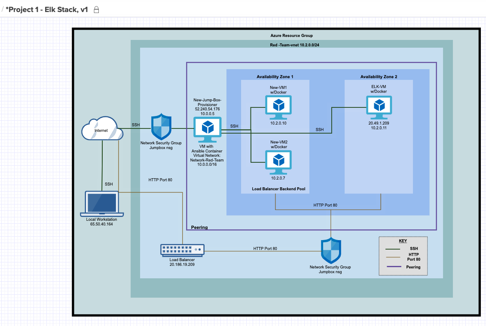

Okechukwu Ordu
6/14/2020

## Automated ELK Stack Deployment

The files in this repository were used to configure the network depicted below.

These files have been tested and used to generate a live ELK deployment on Azure. They can be used to either recreate the entire deployment pictured above. Alternatively, select portions of the __Project 1 - Elk Stack Diagram__ file may be used to install only certain pieces of it, such as Filebeat.

  - filebeat-playbook.yml 
  - filebeat-configuration.yml

This document contains the following details:
- Description of the Topologu
- Access Policies
- ELK Configuration
  - Beats in Use
  - Machines Being Monitored
- How to Use the Ansible Build

### Description of the Topology

The main purpose of this network is to expose a load-balanced and monitored instance of DVWA, the D*mn Vulnerable Web Application.

Load balancing ensures that the application will be highly _functional_, in addition to restricting _DOS attacks_ to the network.
- _TODO: What aspect of security do load balancers protect? What is the advantage of a jump box?_
Load balancers are an integral part when layered within a security model as it distributes workloads across mulitiple servers to prevent overloading, while optimizing productivity and maximizing uptime. Load balancers provide flexibility by rerouting live traffic between servers in the event a server becomes unavailable due to a DDoS attack. 

A jumpbox is a secure computer that is used to provide an additional layer of security. Admins connect to a jumpbox prior to launching any administrative tasks. A jumpbox are viewed as lockdown secure workstations that can limit attacks from hackers to the network.

Integrating an ELK server allows users to easily monitor the vulnerable VMs for changes to the _network_ and system __logs__.
- _TODO: What does Filebeat watch for?_ Filebeat monitors log files or locations that you specify, collects log events, and forwards them to either Elasticsserach or Logstash for indexing.
- _TODO: What does Metricbeat record?_ Metricbeat records metrics and statistics then sends the data to the output of our choice.

The configuration details of each machine may be found below.
_Note: Use the [Markdown Table Generator](http://www.tablesgenerator.com/markdown_tables) to add/remove values from the table_.

| Name                     | Function | IP Address                                    | Operating System |
|--------------------------|----------|-----------------------------------------------|------------------|
| New-Jump-Box-Provisioner | Gateway  | 10.0.0.5 (private) / 52.240.54.176 (public)   | Linux            |
| NewVM1                   | Server   | 10.2.0.10                                     | Linux            |
| New-VM2                  | Server   | 10.2.0.7                                      | Linux            |
| Elk-VM                   | Server   | 10.2.0.11 (private) / 20.49.1.209 (public)    | Linux            |

### Access Policies

The machines on the internal network are not exposed to the public Internet. 

Only the New-Jump-Box-Provisioner machine can accept connections from the Internet. Access to this machine is only allowed from the following IP addresses:
- 65.50.40.164 (LocalHost IP address)

Machines within the network can only be accessed by New-Jump-Box-Provisioner.

Which machine did you allow to access your ELK VM? 
New-Jump-Box-Provisioner

What was its IP address?_  
10.0.0.5

A summary of the access policies in place can be found in the table below.

| Name                     | Publicly Accessible | Allowed IP Addresses |
|--------------------------|---------------------|----------------------|
| New-Jump-Box-Provisioner | Yes                 | 65.50.40.164         |
| New-VM1*                 | No                  | 10.0.0.5             |
| New-VM2*                 | No                  | 10.0.0.5             |
| ELK-VM*                  | No                  | 10.0.0.5             |
* All these VMs can only be accessed from the New-Jump-Box-Provisioner

### Elk Configuration
Ansible was used to automate configuration of the ELK machine. No configuration was performed manually, which is advantageous because...
- _TODO: What is the main advantage of automating configuration with Ansible?_
Ansible provides many advantages such as its simplicity to run complex multi-tier IT application environment. Ansible's playbooks are written in YAML as it is primed for configuration management and automation.

The playbook implements the following tasks:
- _TODO: In 3-5 bullets, explain the steps of the ELK installation play. E.g., install Docker; download image; etc._
-  First ssh into the New-Jump-Box-Provisioner from the localhost machine
-  Next I start and attach the ansible docker container  
-  Once in the root, I will change directories into the /etc/ansible/roles and create the ELK playbook (ELK_Playbook.yml)
-  Run the ELK_playbook.yml and then ssh into the ELK-VM to verify the configuration

The following screenshot displays the result of running `docker ps` after successfully configuring the ELK instance.

!Docker-ps (Images/Docker-ps.png)

### Target Machines & Beats
This ELK server is configured to monitor the following machines:
- NewVM1 - (10.2.0.10)
- NewVM2 - (10.2.0.7)

We have installed the following Beats on these machines:
- Filebeat 

These Beats allow us to collect the following information from each machine:
- Filebeat collects data about the file system. Filebeat is generally used when collecting log files that are generated from Apache, Azure, Nginx web server, and MySQI databases.

### Using the Playbook
In order to use the playbook, you will need to have an Ansible control node already configured. Assuming you have such a control node provisioned: 

SSH into the control node and follow the steps below:

---Filebeat---
- Copy the filebeat-configuration.yml file to /etc/ansible/roles/files
- Update the filebeat-configuration.yml file to include ELK Private IP in lines 1106 and 1806.
- Run the playbook, and navigate to http://20.49.1.209:5601 (Elk VM Public IP) to check that the installation worked as expected.

_TODO: Answer the following questions to fill in the blanks:_
- Which file is the playbook? Where do you copy it? 
The playbook is filebeat-playbook.yml and copy it to /etc/ansible/roles
- Which file do you update to make Ansible run the playbook on a specific machine?  
The filepath to run the ansible playbook on a specific machine is /etc/ansible/hosts file  (IP of the Virtual Machines). 

- How do I specify which machine to install the ELK server on versus which to install Filebeat on?
I have to specify two separate groups in the etc/ansible/hosts file. One of the groups will be webservers which has the IPs of the VMs that I will install Filebeat to. The other group is named elkservers which will have the IP of the VM I will install ELK to.

- Which URL do you navigate to in order to check that the ELK server is running?
http://20.49.1.209:5601

_As a **Bonus**, provide the specific commands the user will need to run to download the playbook, update the files, etc._

To create the filebeat-configuration.yml file: nano filebeat-configuration.yml. For this, I used the filebeat configuration file template.

---
  - name: installing and launching filebeat
    hosts: webservers
    become: true
    tasks:
    - name: download filebeat deb
      command: curl -L -O https://artifacts.elastic.co/downloads/beats/filebeat/filebeat-7.7.1-amd64.deb
    - name: install filebeat deb
      command: dpkg -i filebeat-7.7.1-amd64.deb
    - name: drop in filebeat.yml
      copy:
       src: ./files/filebeat-configuration.yml
       dest: /etc/filebeat/filebeat.yml
    - name: enable and configure system module
      command: filebeat modules enable system
    - name: setup filebeat
      command: filebeat setup
    - name: start filebeat service
      command: service filebeat start

To run the playbook: ansible-playbook filebeat-playbook.yml 
